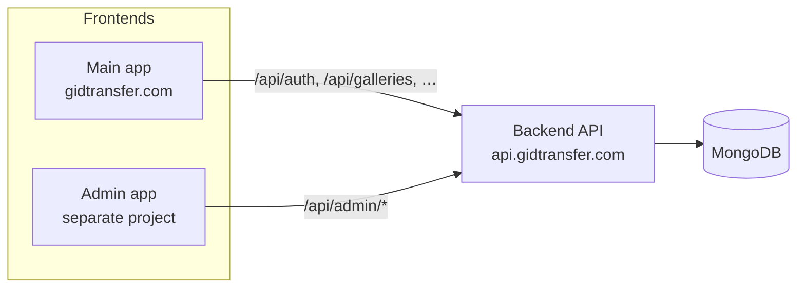

# Frontend responsibilities — main app vs admin app

Gidtransfer has **two separate frontends** that both talk to **this one backend API**.

| Frontend | Domain (production) | Users | API prefix |
|----------|---------------------|-------|------------|
| **Main app** | `https://gidtransfer.com` | Photographers / studios | `/api/*` (not `/api/admin`) |
| **Admin app** | Separate project (e.g. `localhost:3001`) | Platform operators | `/api/admin/*` |

Backend repo: `photo_global_backend`  
API base (production example): `https://api.gidtransfer.com`

---

## Architecture



---

## Environment files

| File | Repo | Purpose |
|------|------|---------|
| `.env` | `photo_global_backend` | API server secrets, DB, CORS, `APP_URL` |
| `docs/env.main-frontend.example` | Main Next app | `NEXT_PUBLIC_API_URL`, `NEXT_PUBLIC_APP_URL`, Google OAuth |
| `docs/env.admin-frontend.example` | Admin Next app | `NEXT_PUBLIC_API_URL` only |

Copy the frontend examples to `.env.local` in each respective frontend project.

---

## Shared deployment (backend `.env`)

These are **backend** settings — configure once on the API server, not in either frontend repo.

```env
# Main app origin(s) in production; add your admin app's origin if deployed separately
CORS_ORIGINS=https://gidtransfer.com,https://www.gidtransfer.com

API_PUBLIC_URL=https://api.gidtransfer.com
APP_URL=https://gidtransfer.com
```

| Variable | Purpose |
|----------|---------|
| `CORS_ORIGINS` | Main app origin in production; add admin app origin if it runs on a different host |
| `API_PUBLIC_URL` | Public HTTPS URL of this API (emails, media URLs) |
| `APP_URL` | **Main photographer app** only — share links, billing redirect, password reset |

The admin app does **not** need its own backend env var. Point the admin frontend at the same `API_PUBLIC_URL`.

---

## Main frontend (`gidtransfer.com`)

**Who uses it:** photographers registering, onboarding, managing clients, galleries, bookings, billing.

### Environment (main frontend project)

Copy `docs/env.main-frontend.example` → `.env.local` in the main Next.js repo.

```env
NEXT_PUBLIC_API_URL=https://api.gidtransfer.com
NEXT_PUBLIC_APP_URL=https://gidtransfer.com
NEXT_PUBLIC_GOOGLE_CLIENT_ID=<same as backend GOOGLE_CLIENT_ID>
```

### Auth

| Step | Endpoint |
|------|----------|
| Register | `POST /api/auth/register` |
| Login | `POST /api/auth/login` |
| Google sign-in | `POST /api/auth/google` |
| Verify email (OTP) | `POST /api/auth/verify-email` |
| Resend OTP | `POST /api/auth/resend-verification` |
| Current user | `GET /api/auth/me` |
| Logout | `POST /api/auth/logout` |
| Forgot / reset password | `POST /api/auth/forgot-password`, `POST /api/auth/reset-password` |

- Store the returned JWT as the **photographer token**.
- Send `Authorization: Bearer <token>` on protected routes.
- Token is a **user** token (`kind` is not `admin`).
- Unverified email users get `403` with `EMAIL_NOT_VERIFIED` on most routes until they verify.

### Screens / features to implement

| Area | API routes | Notes |
|------|------------|-------|
| Onboarding | `GET/POST/PUT /api/onboarding` | Company setup, logo, SMS sender ID request |
| Dashboard | `GET /api/dashboard` | Home stats |
| Clients | `/api/clients` | CRUD |
| Bookings | `/api/bookings` | Calendar, CRUD, reminders |
| Income | `/api/income` | CRUD, yearly summary |
| Galleries | `/api/galleries` | Create, customize, uploads, finals, share links |
| Public gallery (client view) | `/api/public/:companySlug/:gallerySlug` | Client-facing; can live on same domain |
| Trash | `/api/trash` | Restore / empty |
| Settings | `/api/settings` | Profile, studio, watermark, gallery defaults |
| **Help & support** | `GET/POST /api/settings/help-support` | Photographer **submits** issue reports here |
| Billing | `/api/billing/*` | Plans, checkout, subscription, Paystack callback |
| Storage | `GET /api/storage` | Usage breakdown |
| SMS / email test | `/api/sms/*`, `/api/email/*` | Studio tooling |
| Sync / realtime | `/api/sync/*`, `GET /api/events/stream` | Optional incremental sync + SSE |

### Main frontend must NOT

- Call `/api/admin/*` routes.
- Use admin login or store admin JWTs.
- Implement photographer activate/deactivate, admin issue-report inbox, or SMS sender approval — those belong to the admin app.

---

## Admin frontend (separate project)

**Who uses it:** platform staff managing photographers, support tickets, and studio SMS sender IDs.

### Environment (admin frontend project)

Copy `docs/env.admin-frontend.example` → `.env.local` in the admin Next.js repo.

```env
NEXT_PUBLIC_API_URL=https://api.gidtransfer.com
```

### Auth

| Step | Endpoint |
|------|----------|
| Login | `POST /api/admin/auth/login` |
| Current admin | `GET /api/admin/auth/me` |

- Store the returned JWT as the **admin token** (separate from photographer token).
- Send `Authorization: Bearer <adminToken>` on all `/api/admin/*` requests.
- Token has `kind: "admin"`. Photographer tokens are rejected on admin routes.

Admin accounts are created via backend script (`node scripts/createAdmin.js`) or `ADMIN_EMAIL` / `ADMIN_PASSWORD` in `.env` — not via public registration.

### Screens / features to implement

| Area | API routes | Notes |
|------|------------|-------|
| Dashboard / stats | `GET /api/admin/stats` | Totals, open issue count, etc. |
| Photographer list | `GET /api/admin/photographers` | Filters: `onboarded`, `emailVerified`, `isActive`, `planId`, `search`, … |
| Photographer detail | `GET /api/admin/photographers/:userId` | Usage, sessions, subscription |
| **Activate** | `PATCH /api/admin/photographers/:userId/activate` | Re-enable account |
| **Deactivate** | `PATCH /api/admin/photographers/:userId/deactivate` | Disables login, revokes sessions |
| **Verify email** | `POST /api/admin/photographers/:userId/verify-email` | Manual verify without OTP |
| Sessions | `GET /api/admin/photographers/:userId/sessions` | Active / historical logins |
| **Issue reports (support inbox)** | `GET /api/admin/issue-reports` | View reports photographers submitted |
| Resolve / reopen report | `PATCH /api/admin/issue-reports/:id` | Body: `{ "status": "resolved" \| "open" }` |
| SMS sender IDs | `GET /api/admin/sms/sender-ids` | Pending approvals |
| Approve / reject sender | `PATCH .../approve`, `PATCH .../reject` | Studio SMS display name |
| Bulk comms | `POST /api/admin/communications/sms`, `.../email` | Message many photographers |
| Direct message | `POST /api/admin/photographers/:userId/communicate` | Email and/or SMS one photographer |
| Comms history | `GET /api/admin/communications` | Audit log |

### Support flow (cross-app)

1. **Main app** — photographer submits via `POST /api/settings/help-support` (topic, description, optional attachments).
2. **Admin app** — staff lists via `GET /api/admin/issue-reports?status=open`, reads details, marks resolved with `PATCH /api/admin/issue-reports/:id`.

### Admin frontend must NOT

- Call photographer auth (`/api/auth/register`, `/api/auth/login`, etc.).
- Implement gallery upload, client management, bookings, or billing checkout.
- Use photographer JWT for admin API calls.

---

## Quick reference — who owns what

| Feature | Main app | Admin app |
|---------|:--------:|:---------:|
| Register / login photographers | ✓ | |
| Onboarding & studio setup | ✓ | |
| Galleries, clients, bookings, income | ✓ | |
| Billing / Paystack | ✓ | |
| Submit help & support report | ✓ | |
| Admin login | | ✓ |
| View platform stats | | ✓ |
| List / manage photographers | | ✓ |
| Activate / deactivate photographer | | ✓ |
| Verify photographer email | | ✓ |
| View / resolve issue reports | | ✓ |
| Approve / reject SMS sender IDs | | ✓ |
| Send platform SMS / email to photographers | | ✓ |

---

## Local development

| App | Typical URL | API |
|-----|-------------|-----|
| Main | `http://localhost:3000` | `http://127.0.0.1:7100` |
| Admin | `http://localhost:3001` (or any port) | `http://127.0.0.1:7100` |

With `NODE_ENV=development` and empty `CORS_ORIGINS`, the API allows all origins — both apps can call it without extra CORS setup.

Postman collection folder **Admin** documents admin endpoints; **Settings → Help & support** documents photographer issue submission.

Full route list: `GET /api` on a running server, or see `index.js` API index.
